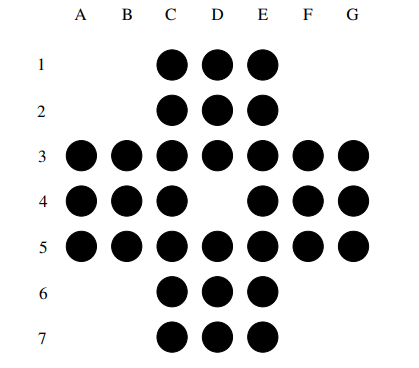
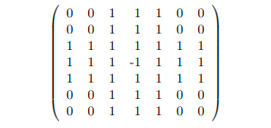

# Resta um
A ideia do jogo é, partindo da configuração inicial mostrada abaixo, onde 32 peças
estão colocadas em 33 espaços, deixar no final apenas uma peça exatamente na posiço onde inicialmente havia o buraco,
seguindo apenas movimentos válidos. Um movimento válido pode ser descrito da seguinte forma. Para cada tripla (A, B, C) de
posições consecutivas no tabuleiro (na horizontal ou na vertical), A e B preenchidas e C vazia, a
peça que está na posicão B pode ser eliminada e a que está em A é deslocada para C.

## Representando o tabuleiro
O tabuleiro será dado através de suas dimensões m×n (m é o número de linhas e n é o
número de colunas) e de uma matriz m×n de {−1, 0, 1} com a seguinte interpretação: 0 representa
uma posição que não pode ser ocupada no tabuleiro, −1 representa uma posição com um buraco no tabuleiro (posição livre) e
1 representa uma posição ocupada com uma peçaa. Assim, por exemplo, o tabuleiro inicial usual do
jogo abaixo poderia ser representado pela matriz 7 × 7 subsequente.

## O programa
O programa percorre o tabuleiro diversas vezes, e a cada posição onde há uma peça, é
avaliado se há um movimento válido para aquela peça, se houver, executa-o, salva na pilha
e volta o cursor do tabuleiro para a posição inicial. Quando o cursor consegue sair do loop
que itera sobre o tabuleiro, é avaliado se houve um movimento possível na iteração, no
caso de não haver, é aplicada a técnica de backtracking.
O programa calcula novos movimentos até que o tabuleiro atual seja igual ao *tabuleiro
gabarito*, calculado a partir do tabuleiro inicial fornecido pelo usuário.

## Heurística do backtrack
Ao identificar que o jogo está travado, o programa inicia a técnica de backtracking, que
consiste em tentar alterar uma decisão que foi feita anteriormente. Para isso, é necessário
avaliar se a pilha de movimentos está vazia, se estiver, indica que nenhum movimento pode
ser alterado, portanto, o tabuleiro recebido não possui solução. Caso contrário, aplicamos o
backtrack.
A heurística escolhida consiste em desempilhar a última decisão, desfazê-la no tabuleiro e
analisar se há outra direção para essa peça. Se houver, executa esse movimento, salva-o
na pilha e volta o cursor para a posição (0, 0), pois o movimento pode desbloquear uma
direção possível para alguma peça anterior. Caso não haja outra direção, desfaz o
movimento e segue o jogo a partir da próxima posição, pois pela própria construção do
código, sabe-se que antes dessa peça, todos os movimentos possíveis foram executados.
O loop segue a partir da posição selecionada pelo cursor, com o jogo “destravado” e a
técnica é replicada até que o tabuleiro seja igual ao gabarito.
Essa abordagem, nos garante algumas coisas importantes para o desenrolar do jogo:
* Um tabuleiro nunca é repetido pois, ao mover o cursor após uma mudança, se
nenhum movimento for possível novamente, uma outra decisão será mudada.
* Ao analisar todas as possibilidades para um movimento, as possibilidades são
cobertas em sua maioria
